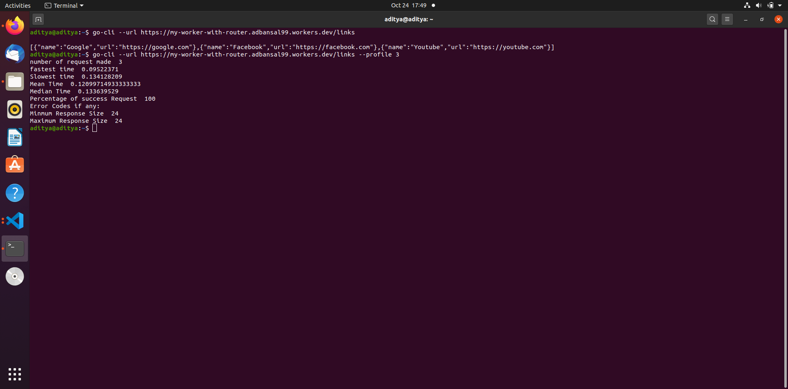
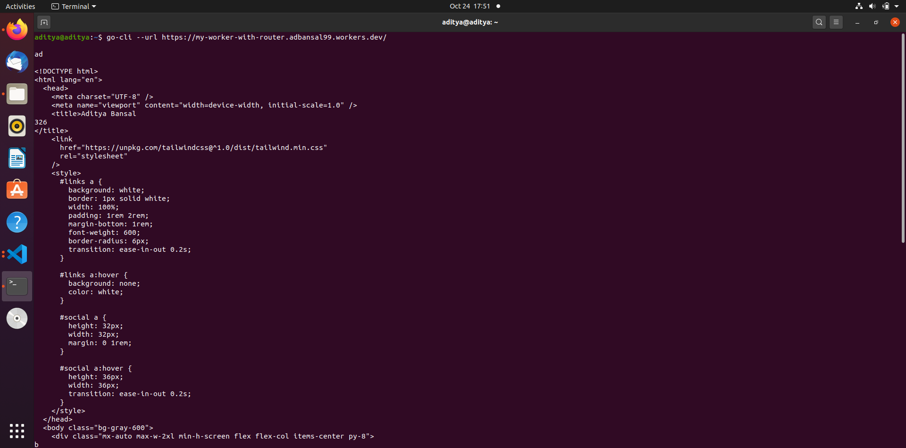
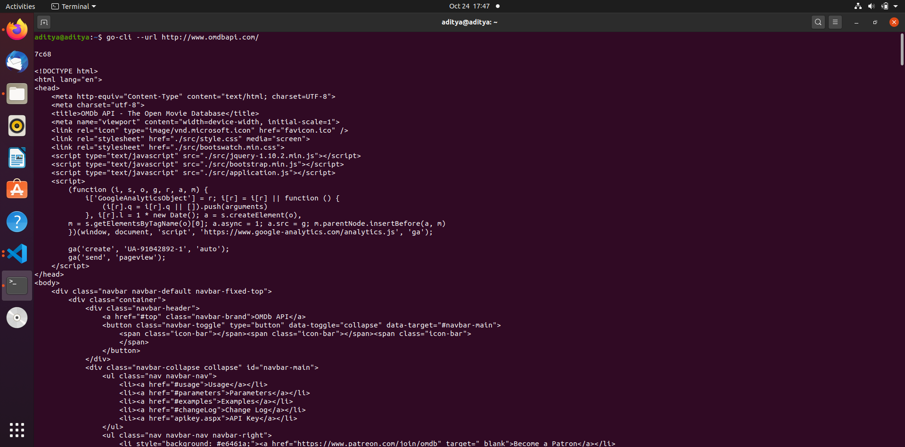
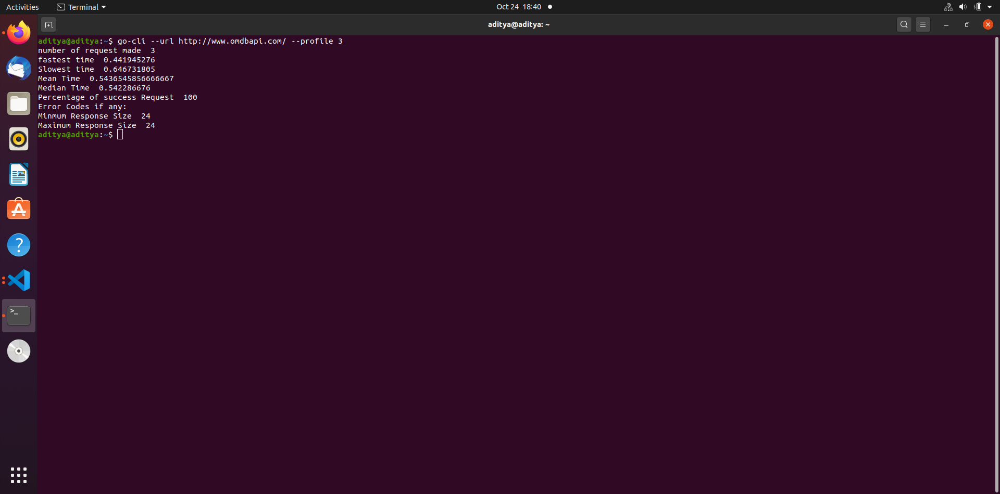

# GO_CLI

## Description

This exercise is a follow-on to the [General Assignment](https://github.com/cloudflare-hiring/cloudflare-2020-general-engineering-assignment). 
It's a command tool which make http request (without using the net/http package) to the entered url and prints the response directly on the command line. If the option is given to make multiple request to the smae url, it print various statical information like maximum taken for a request, minimum time taken and many more

## Dependency


## Download and Install

Unzipped the downloaded file.
Then `cd` into project root directory and use make utility to build the binary:
```
make all
```

Now this can be access by command `bin/go-cli` inside the project root directory. 

To access the command from anywhere,
```
export PATH=$PATH:(path to root directory of project)/bin
```

## USAGE

### After exporting the project root path directory
go-cli:  command to make http request to the requested url and print the response.

Usage: go-cli -h
Usage: go-cli --url
Usage: go-cli --profile

### run inside the project root directory

Usage: bin/go-cli -h
Usage: bin/go-cli --url
Usage: bin/go-cli --profile

Options:
    -u, --url=url     	 input the url.
    -p, --profile=num    number of request to make to url and return the stats(number of request make, Mininum Time taken, Maximum Taken Takenand manymore)
    -h, --help           prints the help info.


## Example Run

Request made to the deployed website as a part of first Assignment





Request made to http://www.omdbapi.com/ without profile tag



